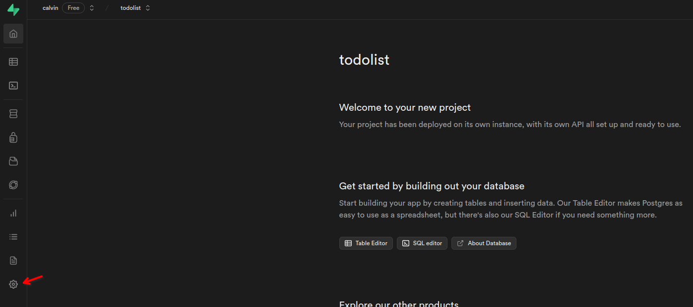
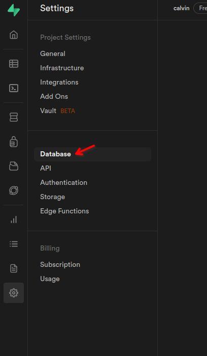
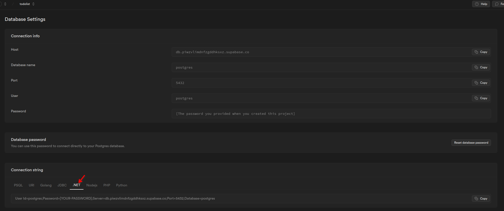
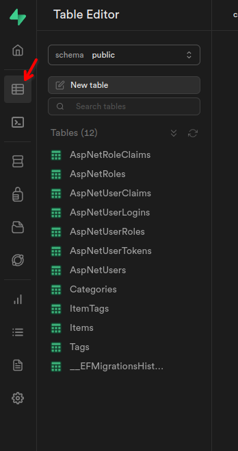

# PostgreSQL hosting

_Last updated October 2023_

This guide will walk you through switching a MySQL backed ASP.NET web app to PostgreSQL, as well as how to host the database using Supabase.

### Table of Contents:

[Switching to PostgreSQL](#switching-to-postgresql)

[Hosting The Database With Supabase](#hosting-database-with-supabase)

### This assumes that you have PostgreSQL installed and setup on your computer, for instructions on how to install PostgreSQL, check out PostgreSQL's website [here](https://www.postgresql.org/download/)

## Switching to PostgreSQL

- First install the NpgSQL by running the command: `dotnet add package Npgsql.EntityFrameworkCore.PostgreSQL`.
- Since we no longer need MySQL, remove any `PackageReference`s for EFCore with MySQL such as `<PackageReference Include="Pomelo.EntityFrameworkCore.MySql" Version="6.0.0" />`
- In `Program.cs`, we will need to change our database to use NpgSQL instead of MySQL. The current configuration, should look something like this:

```c#
builder.Services.AddDbContext<ToDoListContext>(
                        dbContextOptions => dbContextOptions
                          .UseMySql(
                            builder.Configuration["ConnectionStrings:DefaultConnection"], ServerVersion.AutoDetect(builder.Configuration["ConnectionStrings:DefaultConnection"]
                          )
                        )
                      );
```

We will want to switch `.UseMySql`, with `.UseNpgqql`, as well as modify the argument being passed to that method. Our new configuration should look something like this:

```c#
 builder.Services.AddDbContext<ToDoListContext>(
                        dbContextOptions => dbContextOptions
                          .UseNpgsql(
                            builder.Configuration["ConnectionStrings:DefaultConnection"])
                      );
```

The key difference here being the method `.UseNpgsql` only has one argument of our connection string.

- We will also need to update our Connection String, in the `appsettings.json` file. The information of your connection string will be different depending on your PostgreSQL configuration, but the Connection String itself should be structured like this:

```json
{ "ConnectionStrings": { "DefaultConnection": "User Id={USER};Password={PASSWORD};Server=localhost;Port=5432;Database={DBNAME};" } }
```

- After updating our Program.cs, any current migrations you have will no long work. If you have one, delete the `Migrations` folder.
- Create a new migration, with the command `dotnet ef migrations add Initial`.
- Then apply your migrations with `dotnet ef database update`.
- Switching from PostgreSQL to MySQL shouldn't cause any issues with the functionality of your app, as EF Core will take care of all the behind the scenes details and differences between them. Just to make sure, run through the functionality of your app, and double check that everything works as expected. If everything is working, then you can move onto the next section on hosting your database to Supabase.

## Hosting Database With Supabase

- Go to [supabase.com](https://supabase.com/dashboard/sign-up) and create an account.
- Once you've made an account, click on the `New Project` button on the dashboard.
- Give your database a name and a password. You will want to save your password for later.
- Click on `Create new project` _it may take a few minutes for your project to spin up_
- After you have created your database, click on the `Project Settings` button on the left panel
  
- Click on the `Database` tab on the left.
  
- Once you are on the `Database Settings` page, click on the `.NET` option in the `Connection string` panel.
  
- Copy the connection string, and it into your `appsettings.json` file. It should now look something like this:

```json
{
  "ConnectionStrings": {
    "DefaultConnection": "User Id=postgres;Password=[YOUR-PASSWORD];Server=db.piwzvlimdnfzgddhksxz.supabase.co;Port=5432;Database=postgres"
  }
}
```

_Be sure to replace `[YOUR-PASSWORD]` with your password you set earlier when creating the database_

- Now that our connection string is updated, apply your migrations by running the command `dotnet ef database update`.
- Once the command finishes, we can double check that all tables were properly created, by going to the `Table Editor` tab on Supabase.
  
- If all your tables look good, you can move on to [hosting the app on Render](./SiteHosting.md)
