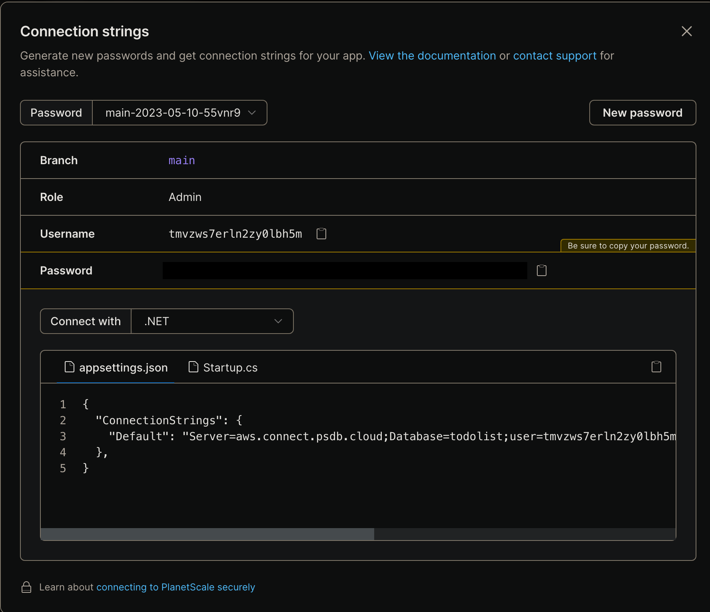
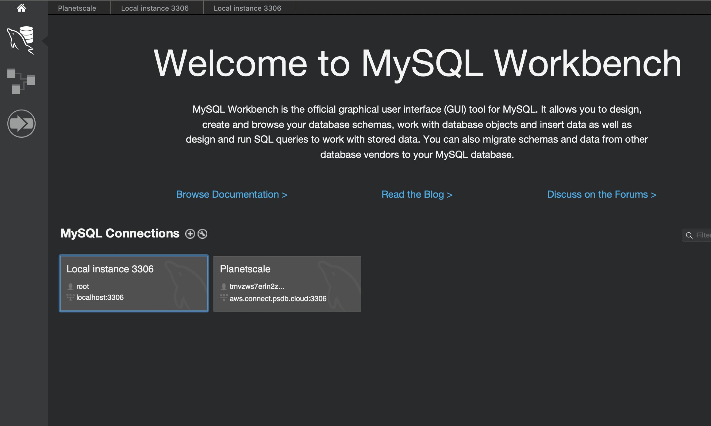
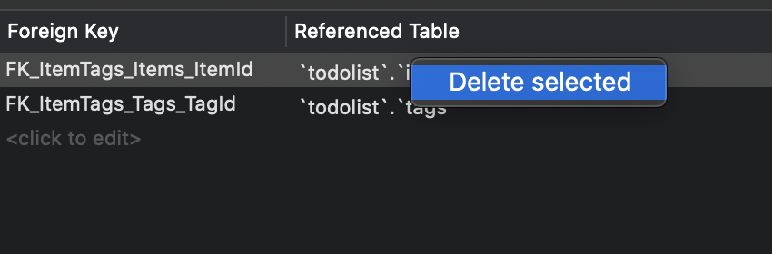
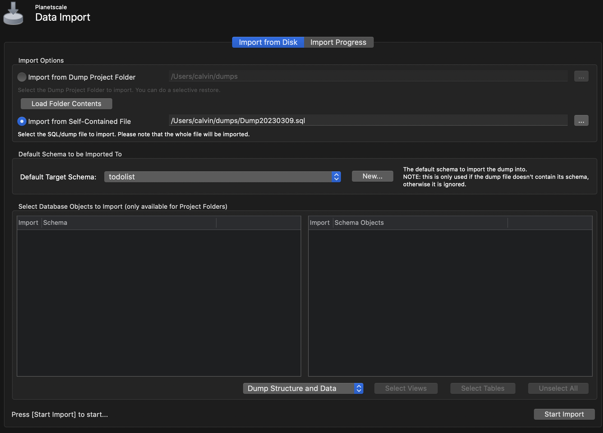

## Planetscale Setup

_Last updated July 2023_

- Go to [Planetscale.com](https://planetscale.com) and create an account
- On the dashboard, click on `create`
  
- Give it a name and set the region
- Wait for the database to initialize
- On the right hand side, click `Connect`
  
- Click `Create password`
- Under the `Connect with` drop down, select `.NET` and copy the appsettings.json
  
  - **You may need to change the connection string from `Default` to `DefaultConnection`, depending on how your app is setup**
- You will also want to save your username and password for later
- Open up MySQL workbench and click on the plus button next to `MySQL Connections`
  
- Set a connection name, and set the method to `Standard (TCP/IP)`
- Hostname should be `aws.connect.psdb.cloud`, port is `3306`. `Username` and `Password` are the ones you copied earlier from the Planetscale setup page
  
- Test the connection to make sure it works, then click `Ok`.
- Before going into the Planetscale database, click the home icon in the top left, then click on your local instance
  
- Due to how Planetscale works, we need to delete our foreign key constraints in our tables. This shouldn't effect the basic functionality of the site, but could lead to some unexpected behaviors. Planetscale won't let us import our database if we have these, so we have to get rid of them to use their service
- Expand your schema, and go to a table that has a foreign key
- Right click, alter table
  
- At the bottom, click `Foreign Keys`
  
- On the left panel, right click and delete all foreign key constraints - do this for every item listed
  
- Click apply at the bottom
- **You will need to do that for every table that has foreign keys**
- Once there are no tables that have foreign key constraints to the `administration tab` and click `Data export`
  
- Under the left panel, click on your schema, and then under the right panel, click on `Select Tables`
  
- At the bottom, click on `Export to self contained file` and pick a path
- Then click start export
- Once that is done, click on the `Home` button in the top left, then click on your Planetscale instance
- Click on administration tab, then data import/restore

- Click on `Import from Self-Contained File` and pick your file
- Under `Default Target Schema` pick the database you specified when creating the database on Planetscale earlier, then click start import
  
- Once that is done, go back to Planetscale and click the branches tab
- Click on `main` and double check that all your tables have been created properly
- If all your tables look good, you can move on to [hosting the app on Render](./SiteHosting.md)
