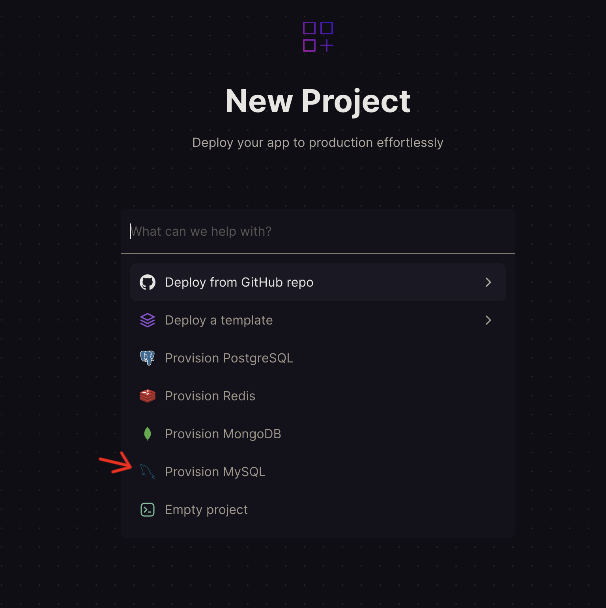

## Railway Setup

_Last updated July 2023_

**Railway is no longer free, but you can still use it to host your database if you'd like**

- Go to [Railway.app](https://railway.app)
- Sign in through Github
- New project, Provision MySQL
  
- Click on the MySQL instance you created
  
- Click on the `Connect` tab
  
- At the bottom, take a look at the environment variables. We will use these to make a connection string for our `appsettings.json` file.
- Plug the following variables into your connection string, like this:

  - "Server={MYSQLHOST};Port={MYSQLPORT};database={MYSQLDATABASE};uid={MYSQLUSER};pwd={MYSQLPASSWORD};"

    Your `appsettings.json` should look something like this:

    ```
    {
        "ConnectionStrings": {
            "DefaultConnection": "Server={MYSQLHOST};Port={MYSQLPORT};database={MYSQLDATABASE};uid={MYSQLUSER};pwd={MYSQLPASSWORD};"
        }
    }
    ```

- In your terminal, make sure you are in your project directory, then run `dotnet ef database update` to update your database on Railway
- Check the data tab to make sure that all tables have been created properly
  
- If all your tables look good, you can move on to [hosting the app on Render](./SiteHosting.md)
