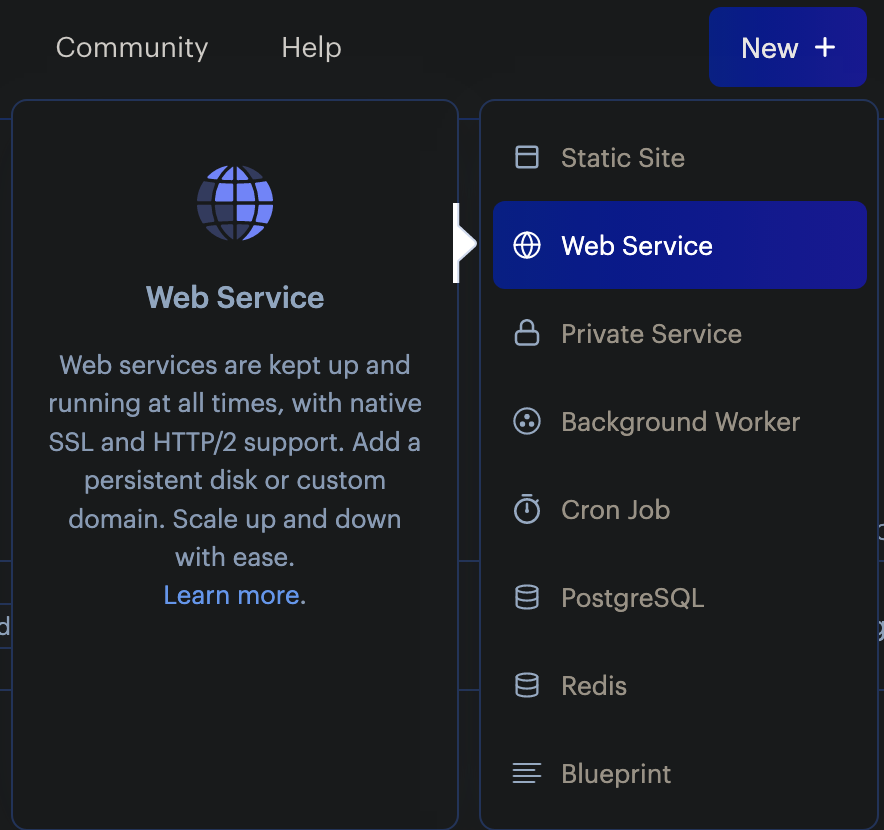
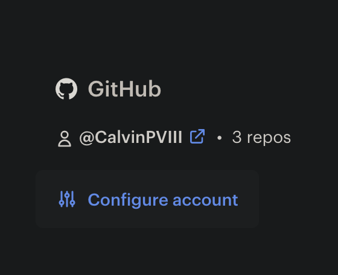
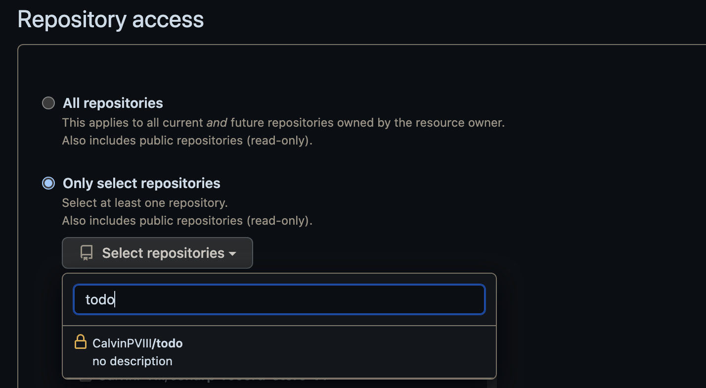
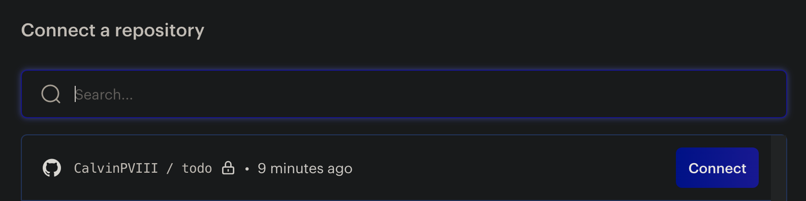
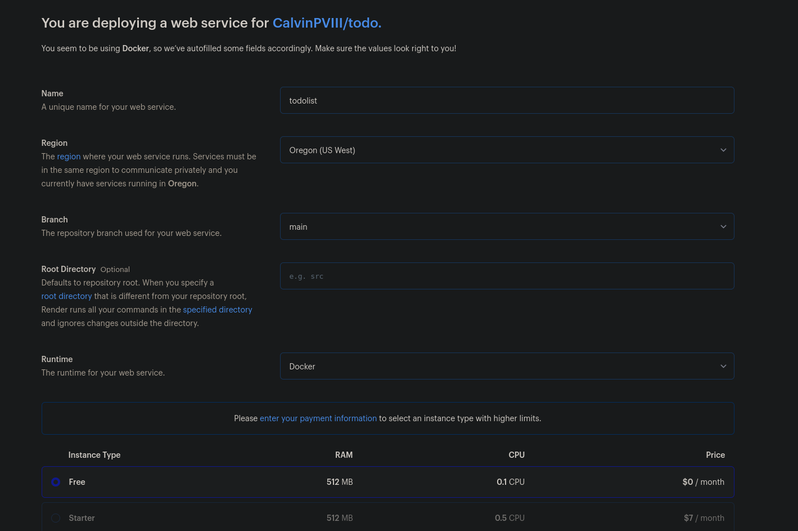
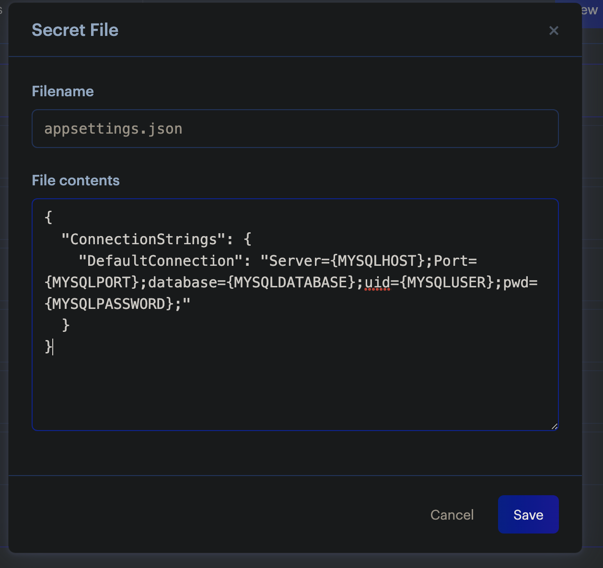
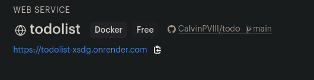

## Hosting the Website with Render

_Last updated July 2023_

- Render has built in support for many different kinds of apps, but it also supports the use of a Dockerfile, which is what we are going to use to host an ASP.NET app.
- In the root of your project folder, make a new file called `Dockerfile`
- Depending on what your application is, your `Dockerfile` may look different. Here are some guides about creating a Docker environment for a .NET application:
  - [Microsoft's tutorial for containerizing a .NET app](https://learn.microsoft.com/en-us/dotnet/core/docker/build-container)
  - [Docker's tutorial for building a .NET Image](https://docs.docker.com/language/dotnet/build-images/)
- If you are trying to host a ASP.NET MVC site or API, then this Dockerfile below should work for you.

  - Paste this into your `Dockerfile`:
  - _Make sure to replace `AppName` on the last line of the Dockerfile to the name of your app_
  - _Make sure that it matches the .NET version of your app_

  ```
  # Set the base image to .NET 6 SDK
  FROM mcr.microsoft.com/dotnet/sdk:6.0 AS build

  # Set the working directory to /app
  WORKDIR /app

  # Copy the project file(s) and restore dependencies
  COPY *.csproj ./
  RUN dotnet restore

  # Copy the remaining source code
  COPY . .

  # Build the application
  RUN dotnet publish -c Release -o out

  # Create the runtime image
  FROM mcr.microsoft.com/dotnet/aspnet:6.0
  WORKDIR /app
  COPY --from=build /app/out .
  ENTRYPOINT ["dotnet", "AppName.dll"]

  ```

- Go to [Render.com](https://render.com), and sign in or create and account through Github.
- Click on `New -> Web Service`
  
- On the right under your Github name, click configure.
  
- Under `Repository Access`, you can either click on all repositories, or click `Select Repositories`, and then pick your ASP.NET app.
  
- Click `Save`.
- Click `Connect` next to the repo of your ASP.NET app.
  
- Fill out the information as you see fit, make sure your runtime is `Docker`, and the instance is `Free`.
  
- Scroll down and click `Advanced -> Add a Secret File`.
- Filename will be `appsettings.json`, and paste in your local appsettings.json to the file contents section.
  
- At the bottom, click `Create Web Service`.
- It will take a few minutes to spin up.
- The dashboard will have a link to your site on the top left of the page
  

  _Once it's finished building, if you click on any links and see an errors along the lines of `dial tcp 127.0.0.1:80: connect: connection refused`, you will need to wait just a bit longer for everything to set up properly._

Your ASP.NET app should now be successfully hosted.
