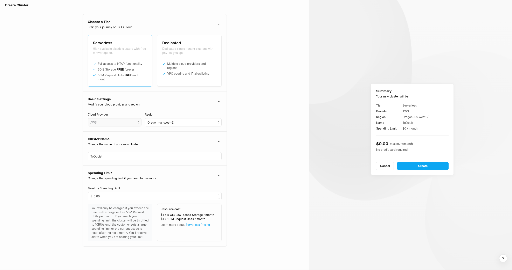
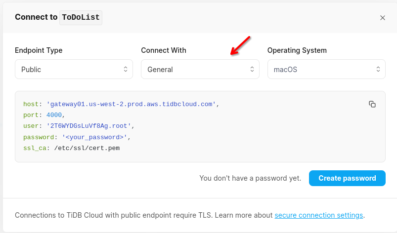
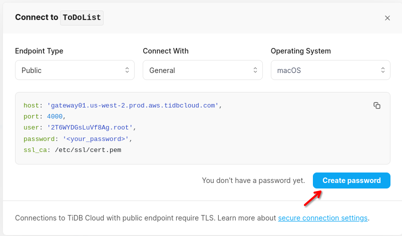

## TiDB Setup

_Last updated October 2023_

- Go to [pingcap.com/tidb-dedicated/](https://www.pingcap.com/tidb-dedicated/) and click on "Sign Up" to create an account.
- Once you've created an account, navigate to the [tidbcloud.com/console/clusters](https://tidbcloud.com/console/clusters) if you are not already there.
- In the top right of the page, click on the "Create Cluster" button.
- At the cluster configuration page, you will want to pick the "Serverless" option, as that does not require any payment options.
- Be sure to also give your cluster a name, as that will be important later.
  
- On the right side of the page, click on "Create"
- Now, on the cluster overview page, click on the "Connect" button in the top right.
  
- In the pop up that is now on screen, select "General" from the "Connect With" dropdown.
  
- In the bottom right of the page, click "Create Password".
  
- Once you click "Create Password", "<your_password>" should be replaced with a new password. **This password can only be viewed once**
- Now we are going to use this info to create our connection string for our app.
- We now have a set of key value pairs for different variables that are needed to connect to our database with. Plug the following variables into your connection string, like this:

  - "Server={host};Port={port};database={your cluster name};uid={user};pwd={password};"

    Your `appsettings.json` should look something like this:

    ```
    {
        "ConnectionStrings": {
            "DefaultConnection": "Server=gateway01.us-west-2.prod.aws.tidbcloud.com;Port=4000;database=todolist;uid=2aTAWFrB4MJVFfk.root;pwd=<your_password>;"
        }
    }
    ```

- In your terminal, after navigating to the directory of your project's `.csproj` file, run the command `dotnet ef database update`. This will update our database schema on the cluster.
- To confirm that our database schema has been successfully updated, navigate to the "Chat2Query" tab, and expand your database name.

  

- If all your tables look good, you can move on to [hosting the app on Render](./SiteHosting.md)
