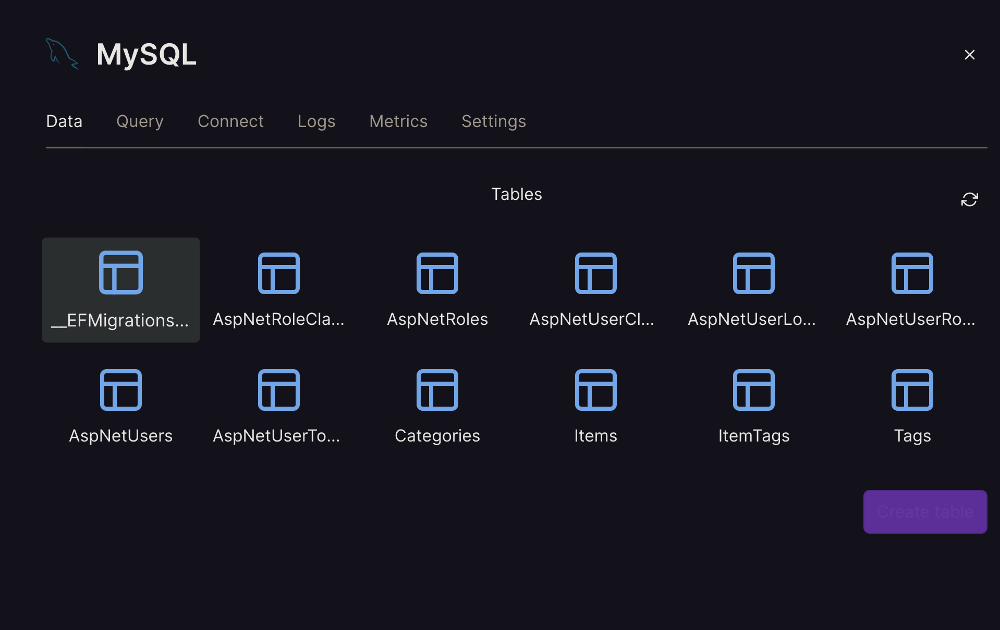
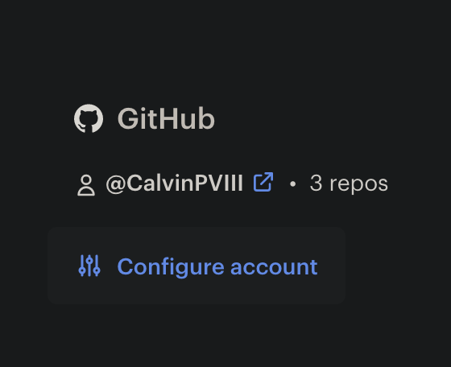
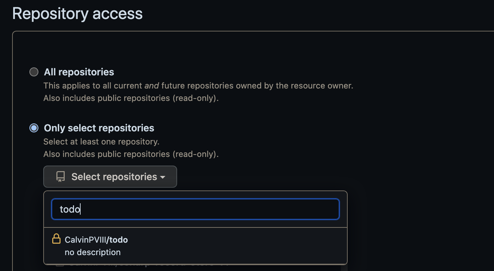

# Easy Hosting for C# ASP.net Applications

## Setting Up the Database

- Two options for hosting the database portion: Planetscale and Railway, both have pros and cons.

### Railway:

Pros:

- Easy to setup
- No extra configuration required

Cons:

- Limited to 500 hours of uptime, or $5 of free credit, per month
- Limits are shared across all databases
- Database will shutdown when limits are reached

### Planetscale:

Pros:

- Only sleeps after 7 days of inactivity

Cons:

- More difficult to setup
- Has some specific restrictions on your schema

### Railway setup:

**Only do this, or the Planetscale setup, not both**

- Go to [Railway.app](railway.app)
- Sign in through github
- New project, Provision MySQL
  
- Click on the MySQL instance you created
  
- Click on the `Connect` tab
  
- Look at variables and make a connection string that looks like this. replacing the variables in curly brackets with the matching values:

  - "Server={MYSQLHOST};Port={MYSQLPORT};database={MYSQLDATABASE};uid={MYSQLUSER};pwd={MYSQLPASSWORD};"

    Your `appsettings.json` should look like this:

    ```
    {
        "ConnectionStrings": {
            "DefaultConnection": "Server={MYSQLHOST};Port={MYSQLPORT};database={MYSQLDATABASE};uid={MYSQLUSER};pwd={MYSQLPASSWORD};"
        }
    }
    ```

- Run `dotnet ef database update` to update your database on Railway
- Check the data tab to make sure that all tables are there
  

### Planetscale setup

**If you have already done the Railway setup, you don't need to do this**

- Go to [Planetscale.com](planetscale.com) and create an account
- On the dashboard, click on `create`
  
- Give it a name and set the region
- Wait for the database to initialize
- On the right hand side, click `Connect`
  
- Click `Create password`
- Under the `Connect with` drop down, select `.NET` and copy the appsettings.json
  
  - **You may need to change the connection string from `Default` to `DefaultConnection`, depending on how your app is setup**
- You will also want to save your username in password for later
- Open up MySQL workbench and click on the plus button next to `MySQL Connections`
  
- Set a connection name, and set the method to `Standard (TCP/IP)`
- Hostname should be `aws.connect.psdb.cloud`, port is `3306`. `Username` and `Password` are the ones you copied earlier from the Planetscale setup page
  
- Test the connection to make sure it works, then click `Ok`.
- Before going into the Planetscale database, click the home icon in the top left, then click on your local instance.
  
- We need to delete our foreign key constraints in our tables. Expand your schema, and go to a table that has a foreign key
- Right click, alter table
  
- At the bottom, click `Foreign Keys`
  
- On the left panel, right click and delete all foreign key constraints - do this for everything listed
  
- Click apply at the bottom
- **You will need to do that for every table that has foreign keys**
- Go to the `administration tab` and click `Data export`
  
- Under the left panel, click on your schema, and then under the right panel, click on `Select Tables`
  
- At the bottom, click on `Export to self contained file` and pick a path
- Then click start export
- Once that is done, click on the `Home` button in the top left, then click on your Planetscale instance
- Click on administration tab, then data import/restore

- Click on `Import from Self-Contained File` and pick your file
- Under `Default Target Schema` pick the schema you created earlier, then click start import
  
- Once that is done, go back to Planetscale, and click the branches tab
- Click on `main` and double check that all tables are there

## Hosting the website

- In your repo, make new file called `Dockerfile`
- Pase in this code:

```
# Set the base image to .NET 6 SDK
FROM mcr.microsoft.com/dotnet/sdk:6.0 AS build

# Set the working directory to /app
WORKDIR /app

# Copy the project file(s) and restore dependencies
COPY *.csproj ./
RUN dotnet restore

# Copy the remaining source code
COPY . .

# Build the application
RUN dotnet publish -c Release -o out

# Create the runtime image
FROM mcr.microsoft.com/dotnet/aspnet:6.0
WORKDIR /app
COPY --from=build /app/out .
ENTRYPOINT ["dotnet", "AppName.dll"]

```

- Replace `AppName` on the last line with the name of your app

- Go to [Render.com](render.com)
- Click on New -> Web Service
  
- On the right under your github name, click configure
  
- Under `Repository Access`, you can either click on all Repositories, or click `Select Repositories`, and then pick your ASP.net app
  
- Click save
- Click `Connect` next to the repo your ASP.net app
  
- Fill out the information as you see fit, make sure your runtime is `Docker`, and the instance is `Free`
- Click advanced -> add a secret file
- Name is `appsettings.json`, paste in your local appsettings.json file contents
  
- At the bottom, click `Create Web Service`
- It takes a few minutes to spin up. If you click on any links and see an error along the lines of `dial tcp 127.0.0.1:80: connect: connection refused`, wait a little bit longer
