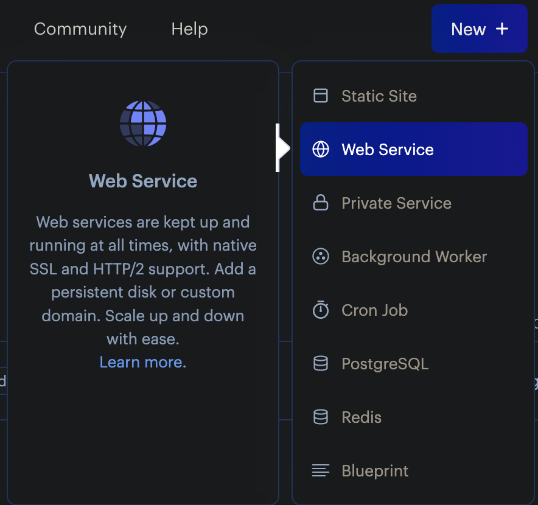
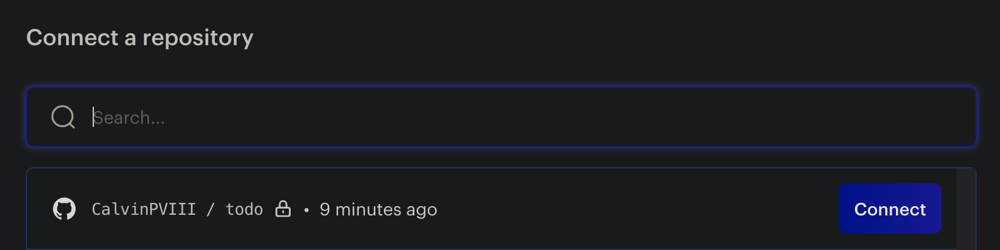
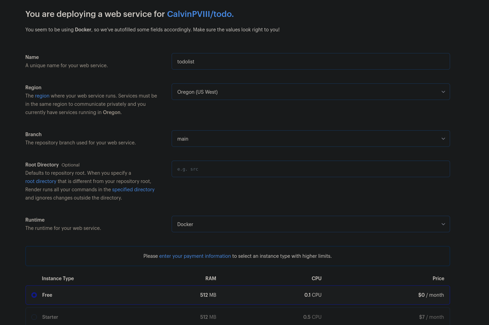

# Easy Hosting for C# ASP.NET Applications

This guide will walk you through hosting a MySQL database and an ASP.NET MVC app.

### Table of Contents:

[Setting Up The Database](#setting-up-the-database)

[Hosting the MySQL database with TiDB](#tidb-setup)

[Hosting the MySQL database with Railway](#railway-setup)

[Hosting the MySQL database with Planetscale](#planetscale-setup)

[Hosting the website with Render](#hosting-the-website-with-render)

## Setting Up the Database

In order to setup our ASP.NET app with a MySQL database, there are two things we will need to configure: the database and the website itself. For the website, we will use a service called Render, along with a Dockerfile. For the database we have a few options. Below are a list of options this guide covers, as well as some pros and cons for each.

### TiDB:

Pros:

- Easy to scale up/down
- 25 GB of row storage and 25 GB of column storage
- Built using AWS infrastructure

Cons:

- Free tier can be a bit slow

### Railway:

Pros:

- Easy to setup
- No extra configuration required

Cons:

- Limited to 500 hours of uptime, or $5 of free credit, per month
- Limits are shared across all databases
- Database will shutdown when limits are reached
- \*\*As of September 2023, Railway no longer offers a free tier. You can still use Railway to host your database, and the instructions below should still work. See Railways pricing options [here](https://railway.app/pricing). For another free hosting options, check out [TiDB](#tidb-setup)

### Planetscale:

Pros:

- Only sleeps after 7 days of inactivity

Cons:

- More difficult to setup
- Has some specific restrictions on your schema

Overall, I would recommend using TiDB as it is by far the most straight forward and completely free option, but you can try out the other providers should TiDB not work for you.

You can also check out other free options that are listed in [this Github repo](https://github.com/cloudcommunity/Free-Hosting#databases-dbaas) that has a list of free database providers and other hosting options.

**You only need to follow the setup for one database provider.**

## TiDB Setup

- Go to [pingcap.com/tidb-dedicated/](https://www.pingcap.com/tidb-dedicated/) and click on "Sign Up" to create an account.
- Once you've created an account, navigate to the [tidbcloud.com/console/clusters](https://tidbcloud.com/console/clusters) if you are not already there.
- In the top right of the page, click on the "Create Cluster" button.
- At the cluster configuration page, you will want to pick the "Serverless" option, as that does not require any payment options.
- Be sure to also give your cluster a name, as that will be important later.
  
- On the right side of the page, click on "Create"
- Now, on the cluster overview page, click on the "Connect" button in the top right.
  
- In the pop up that is now on screen, select "General" from the "Connect With" dropdown.
  
- In the bottom right of the page, click "Create Password".
  
- Once you click "Create Password", "<your\*password>" should be replaced with a new password. **This password can only be viewed once**
- Now we are going to use this info to create our connection string for our app.
- We now have a set of key value pairs for different variables that are needed to connect to our database with. Plug the following variables into your connection string, like this:

  - "Server={host};Port={port};database={your cluster name};uid={user};pwd={password};"

    Your `appsettings.json` should look something like this:

    ```
    {
        "ConnectionStrings": {
            "DefaultConnection": "Server=gateway01.us-west-2.prod.aws.tidbcloud.com;Port=4000;database=todolist;uid=2aTAWFrB4MJVFfk.root;pwd=<your_password>;"
        }
    }
    ```

- In your terminal, after navigating to the directory of your project's `.csproj` file, run the command `dotnet ef database update`. This will update our database schema on the cluster.
- To confirm that our database schema has been successfully updated, navigate to the "Chat2Query" tab, and expand your database name.

  

- You should see all your tables in your schema. TiDB should now be setup, and you can move on to [Hosting the website with Render](#hosting-the-website-with-render)

## Railway Setup

**If you have already setup your database with TiDB or another provider, you can skip to the '[Hosting the website with Render](#hosting-the-website-with-render)' section**

**Railway is no longer free, but you can still use it to host your database if you'd like**

- Go to [Railway.app](https://railway.app)
- Sign in through Github
- New project, Provision MySQL
  
- Click on the MySQL instance you created
  
- Click on the `Connect` tab
  
- At the bottom, take a look at the environment variables. We will use these to make a connection string for our `appsettings.json` file.
- Plug the following variables into your connection string, like this:

  - "Server={MYSQLHOST};Port={MYSQLPORT};database={MYSQLDATABASE};uid={MYSQLUSER};pwd={MYSQLPASSWORD};"

    Your `appsettings.json` should look something like this:

    ```
    {
        "ConnectionStrings": {
            "DefaultConnection": "Server={MYSQLHOST};Port={MYSQLPORT};database={MYSQLDATABASE};uid={MYSQLUSER};pwd={MYSQLPASSWORD};"
        }
    }
    ```

- In your terminal, make sure you are in your project directory, then run `dotnet ef database update` to update your database on Railway
- Check the data tab to make sure that all tables have been created properly
  
  - If all your tables look good, you can move on to setting up the site itself on Render

## Planetscale Setup

**If you have already done the Railway or TiDB setup, you don't need to do this**

- Go to [Planetscale.com](https://planetscale.com) and create an account
- On the dashboard, click on `create`
  
- Give it a name and set the region
- Wait for the database to initialize
- On the right hand side, click `Connect`
  
- Click `Create password`
- Under the `Connect with` drop down, select `.NET` and copy the appsettings.json
  
  - **You may need to change the connection string from `Default` to `DefaultConnection`, depending on how your app is setup**
- You will also want to save your username and password for later
- Open up MySQL workbench and click on the plus button next to `MySQL Connections`
  
- Set a connection name, and set the method to `Standard (TCP/IP)`
- Hostname should be `aws.connect.psdb.cloud`, port is `3306`. `Username` and `Password` are the ones you copied earlier from the Planetscale setup page
  
- Test the connection to make sure it works, then click `Ok`.
- Before going into the Planetscale database, click the home icon in the top left, then click on your local instance
  
- Due to how Planetscale works, we need to delete our foreign key constraints in our tables. This shouldn't effect the basic functionality of the site, but could lead to some unexpected behaviors. Planetscale won't let us import our database if we have these, so we have to get rid of them to use their service
- Expand your schema, and go to a table that has a foreign key
- Right click, alter table
  
- At the bottom, click `Foreign Keys`
  
- On the left panel, right click and delete all foreign key constraints - do this for every item listed
  
- Click apply at the bottom
- **You will need to do that for every table that has foreign keys**
- Once there are no tables that have foreign key constraints to the `administration tab` and click `Data export`
  
- Under the left panel, click on your schema, and then under the right panel, click on `Select Tables`
  
- At the bottom, click on `Export to self contained file` and pick a path
- Then click start export
- Once that is done, click on the `Home` button in the top left, then click on your Planetscale instance
- Click on administration tab, then data import/restore

- Click on `Import from Self-Contained File` and pick your file
- Under `Default Target Schema` pick the database you specified when creating the database on Planetscale earlier, then click start import
  
- Once that is done, go back to Planetscale and click the branches tab
- Click on `main` and double check that all your tables have been created properly
- If all tables look correct, you can move on to hosting the site itself

## Hosting the Website with Render

- Render has built in support for many different kinds of apps, but it also supports the use of a Dockerfile, which is what we are going to use to host an ASP.NET app.
- In the root of your project folder, make a new file called `Dockerfile`
- Depending on what your application is, your `Dockerfile` may look different. Here are some guides about creating a Docker environment for a .NET application:
  - [Microsoft's tutorial for containerizing a .NET app](https://learn.microsoft.com/en-us/dotnet/core/docker/build-container)
  - [Docker's tutorial for building a .NET Image](https://docs.docker.com/language/dotnet/build-images/)
- If you are trying to host a ASP.NET MVC site or API, then this Dockerfile below should work for you.

  - Paste this into your `Dockerfile`:
  - _Make sure to replace `AppName` on the last line of the Dockerfile to the name of your app_
  - _Make sure that it matches the .NET version of your app_

  ```
  # Set the base image to .NET 6 SDK
  FROM mcr.microsoft.com/dotnet/sdk:6.0 AS build

  # Set the working directory to /app
  WORKDIR /app

  # Copy the project file(s) and restore dependencies
  COPY *.csproj ./
  RUN dotnet restore

  # Copy the remaining source code
  COPY . .

  # Build the application
  RUN dotnet publish -c Release -o out

  # Create the runtime image
  FROM mcr.microsoft.com/dotnet/aspnet:6.0
  WORKDIR /app
  COPY --from=build /app/out .
  ENTRYPOINT ["dotnet", "AppName.dll"]

  ```

- Go to [Render.com](https://render.com), and sign in or create and account through Github.
- Click on `New -> Web Service`
  
- On the right under your Github name, click configure.
  
- Under `Repository Access`, you can either click on all repositories, or click `Select Repositories`, and then pick your ASP.NET app.
  
- Click `Save`.
- Click `Connect` next to the repo of your ASP.NET app.
  
- Fill out the information as you see fit, make sure your runtime is `Docker`, and the instance is `Free`.
  
- Scroll down and click `Advanced -> Add a Secret File`.
- Filename will be `appsettings.json`, and paste in your local appsettings.json to the file contents section.
  
- At the bottom, click `Create Web Service`.
- It will take a few minutes to spin up.
- The dashboard will have a link to your site on the top left of the page
  

  _Once it's finished building, and you click on any links and see an errors along the lines of `dial tcp 127.0.0.1:80: connect: connection refused`, you will need to wait just a bit longer for everything to work properly._

Your ASP.NET app should now be successfully hosted.

_Disclaimer: service providers will often change their pricing and plan options, depending on when you view this guide, some steps may be different, and some providers may not offer the same plans. This guide was last updated in September of 2023_
